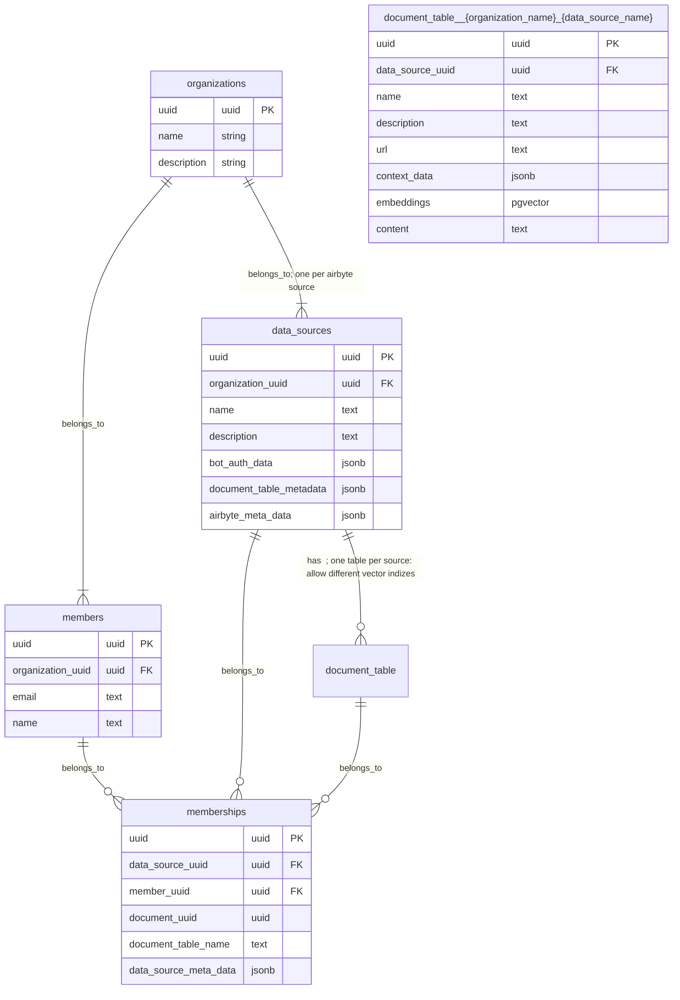
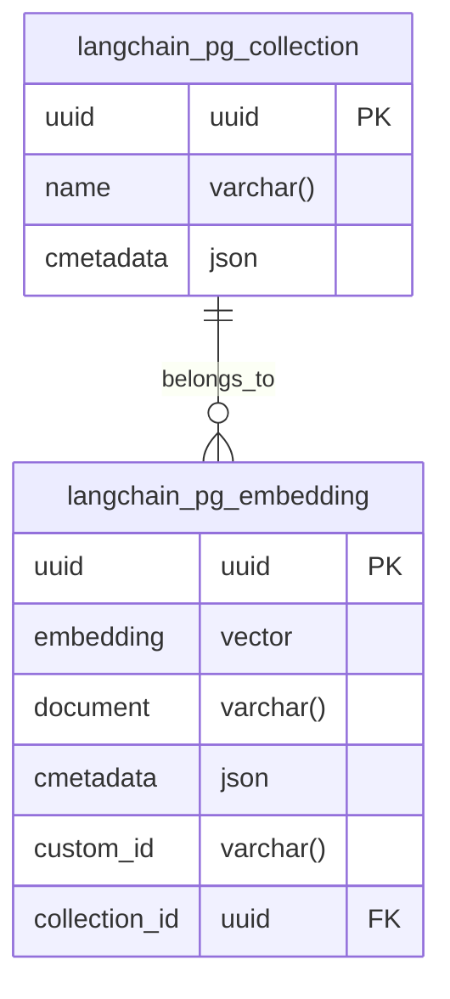

# [aishe.ai](https://aishe.ai/) Core


The goal of is to provide a solution for small and medium enterprises in Europe to use LLM-based AI in a manner compliant with GDPR and typical privacy concerns of companies.

aishe.ai allows teams to ask questions in natural language about the organization, projects, processes, and applications. 
To achieve this, aishe.ai scrapes the company's information systems, such as Confluence, documents, and Git repositories. 
It serves as a virtual team assistant, distinguishing itself from a personal assistant.

[More Info](https://pad.finf.uni-hannover.de/aisheai)

## Features

- **“Build your secure ChatGPT with your own data”**
- **Autonomous Tool Usage:**
  - Google search
  - Visit websites and scrape entire sitemaps
  - Firecrawl
- **Image Generation:**
  - DALL-E
  - Multi-modal capabilities, allowing it to answer questions about images
- **File Translation:**
  - Translate files like PDFs using DeepL
- **GitHub Integration:**
  - Access and regularly synchronize with internal knowledge sources
  - GitHub repository: aishe-ai/airbyte (Airbyte Fork)
- **Chat Integration:**
  - Slack
- **User Feedback:**
  - Users can provide feedback and rate/comment on LLM outputs
  - Integrated with Langfuse
- **Environment Support:**
  - Supports different environments as long as Docker Compose or Kubernetes is available

### Planned Features

#### Near Future (1-3 Months)

- **Support for More Data Sources:** Expanding to include data sources not yet supported by Airbyte.
- **Develop Custom Airbyte Sources:** Creating proprietary Airbyte sources to meet unique requirements.
- **Self-Service Portal:** 
  - **Configuration:** Allow users to configure their own settings.
  - **Monitoring:** Provide tools for users to monitor their data and AI interactions.
  - **Setup:** Simplify the setup process for new users.
- **Project-Based Assistant:** Tailoring the assistant to work on a per-project basis rather than for the entire organization.
  - **Overview Queries:** For example, answering questions like "What security vulnerabilities does this project have?"
  - **Data Integration:** Combine data from various sources to derive actions or questions.
- **Git Tool Integration:** Boris is interested in integrating his Git tool.

#### Distant Future (6-12 Months)

- **Email Drafting:** Automate the creation of email drafts.
- **Meeting Transcript Integration:** Connect meeting transcript sources like Fireflies to Airbyte.
- **Local LLMs:** Use local LLMs instead of cloud providers to enhance privacy and control.
- **Further Chat Integrations:** Expand chat integrations to include platforms like Teams and Zoom.
- **Additional Data Sources:** 
  - **SharePoint:** Integrate with SharePoint.
  - **RBAC-Compliant Vector Table:** Implement a vector table that respects the role-based access control (RBAC) of the source.

## Setup and Deployment

### Slack Setup
1. You have to create a new slack app, [URL](https://api.slack.com/apps)
2. Modify the below manifest to your needs/config, following are required to change:
    - `request_url`, `url`
        - your instance url
    


```yaml
{
    "display_information": {
        "name": "aishe.ai",
        "description": "Assistant LLM",
        "background_color": "#070708",
        "long_description": "Chat Assistant"
    },
    "features": {
        "bot_user": {
            "display_name": "aisheAI",
            "always_online": true
        },
        "slash_commands": [
            {
                "command": "/aishe-health-check",
                "url": "https://$DOMAIN/healthcheck",
                "description": "Check if the backend services are running",
                "should_escape": false
            },
            {
                "command": "/aishe-example-prompts",
                "url": "https://$DOMAIN/example-prompts/",
                "description": "Shows examples prompts",
                "should_escape": false
            }
        ]
    },
    "oauth_config": {
        "scopes": {
            "bot": [
                "channels:history",
                "channels:read",
                "chat:write",
                "commands",
                "files:read",
                "files:write",
                "groups:history",
                "groups:read",
                "mpim:read",
                "remote_files:write",
                "users:read"
            ]
        }
    },
    "settings": {
        "event_subscriptions": {
            "request_url": "https://$DOMAIN/slack/event/",
            "bot_events": [
                "member_joined_channel",
                "message.groups"
            ]
        },
        "interactivity": {
            "is_enabled": true,
            "request_url": "https://$DOMAIN/slack/rating/"
        },
        "org_deploy_enabled": false,
        "socket_mode_enabled": false,
        "token_rotation_enabled": false
    }
}
```

### Prerequisites
- Install Python 3.9 or set the version to it.
- Install necessary system packages:
    ```bash
    sudo apt install postgresql postgresql-contrib
    sudo apt-get install python3.9-dev
    sudo apt-get install --reinstall libpq-dev
    ```
    
### Conventional Setup

0. Copy `.env.example` to `.env` and modify the content.
1. Install `tesseract-ocr` for your system.
2. Install Python dependencies, see [Poetry](#poetry) 
3. Install Chromium and other dependencies:
    ```bash
    pip install -q playwright beautifulsoup4
    playwright install
    ```
4. Create an ngrok domain.
5. Install [ngrok](https://ngrok.com/download).
6. Set up [ngrok agent auth](https://dashboard.ngrok.com/get-started/your-authtoken).
7. [Set up Google access](https://python.langchain.com/docs/integrations/tools/google_search) for LLM and add keys to `.env`.
8. Set up Langsmith in `.env`.
9. Set up [Langfuse](https://github.com/langfuse/langfuse?tab=readme-ov-file#get-started) and its needed envs.
10. Set up [Firecrawl](https://www.firecrawl.dev/) and its needed envs.
11. Start FastAPI:
    ```bash
    uvicorn app:app --reload
    ```
    or
    ```bash
    python3.9 -m uvicorn app:app --reload --port 8888
    ```
11. Start ngrok:
    ```bash
    ngrok http --domain=DOMAIN 8000
    ```
    (Domain must be the same as the bot creation)


### Poetry

Poetry is a tool for dependency management and packaging in Python. It helps to manage project dependencies, build and publish packages, and ensure reproducibility.

1. Install Poetry:
    ```bash
    curl -sSL https://install.python-poetry.org | python3 -
    ```
2. Install project dependencies:
    ```bash
    poetry install
    ```
3. Activate the virtual environment created by Poetry:
    ```bash
    poetry shell
    ```

## Docker

### Docker Compose Setup

0. Follow steps 0-8 from the [Conventional Setup](#conventional-setup) to set up the environment variables and required services.
1. Build the core image:
    ```bash
    docker build -t aishe-ai-core .
    ```
2. Optionally, choose if you want/able to run Airbyte:
3. Run the Docker Compose stack:
    ```bash
    docker compose -f dev-docker-compose.yaml -p unified_aishe_ai up
    ```

### Production Setup

1. Follow steps 0-8 from the [Conventional Setup](#conventional-setup) to set up the environment variables and required services.
2. Start the production environment with Docker Compose:
    ```bash
    docker-compose -f prod-docker-compose.yaml --env-file .env -p aishe_ai up
    ```

### Run Docker Image

- [Public image repository](europe-west10-docker.pkg.dev/aisheai/docker-images/core:latest)
- Run the Docker image:
    ```bash
    docker run -d -p 80:80 --env-file .env aishe-ai
    ```

## Troubleshooting

### Browser Issues with Web Scraping
- If the browser is not starting (e.g., within the `webpage_tool`):
    - Add to the browser launch parameters:
        ```python
        args=["--disable-gpu"]
        ```
    - Example:
        ```python
        browser = await p.chromium.launch(headless=True, args=["--disable-gpu"])
        ```
    - This issue is commonly observed with WSL2 systems.

## Formatting

- Use `black` for code formatting:
    ```bash
    black .
    ```

## Testing

### Running Specific Modules from Root
1. Ensure each folder has a `__init__.py` file. If unsure, run:
    ```bash
    find . -type d \( -path './.venv' -o -path './__pycache__' -o -path './downloads' -o -path './sql' \) -prune -o -type d -exec sh -c 'for dir; do [ ! -f "$dir/__init__.py" ] && touch "$dir/__init__.py" && echo "Created: $dir/__init__.py"; done' sh {} +
    ```
2. Run the module:
    ```bash
    python -m llm.vectorstores.pgvector.non_rbac
    ```

# Wiki
## Tech Stack

### [Airbyte](https://github.com/aishe-ai/airbyte)
**Data Integration**
- **Example:** Airbyte is used to seamlessly integrate various data sources into aishe.ai. For instance, it can connect to a company’s Confluence space, Git repositories, and document storage to aggregate all relevant data.
- **Usage in aishe.ai:** Airbyte facilitates the extraction, transformation, and loading (ETL) of data from disparate sources, ensuring that aishe.ai has access to up-to-date and comprehensive information for generating accurate responses and insights.

### [Langfuse](https://github.com/langfuse/langfuse)
**User Feedback and Interaction Management**
- **Example:** Langfuse is used to collect and manage user feedback on AI-generated outputs. For example, after aishe.ai provides an answer or generates a document, users can rate the response and provide comments.
- **Usage in aishe.ai:** Langfuse helps in gathering user feedback, which is crucial for continuous improvement of the AI models. It allows aishe.ai to adapt and refine its responses based on real user interactions and feedback.

### [Langchain](https://github.com/langchain-ai/langchain)
**Building Complex AI Workflows**
- **Example:** Langchain is used to create complex workflows where multiple AI models and tools are orchestrated to solve specific tasks. For instance, generating a project report might involve data retrieval, natural language processing, and summarization steps.
- **Usage in aishe.ai:** Langchain enables the creation of sophisticated pipelines that combine various AI capabilities, ensuring that aishe.ai can handle multi-step processes efficiently and effectively.

### [FastAPI](https://github.com/tiangolo/fastapi)
**Backend API Development**
- **Example:** FastAPI is used to develop the backend APIs that power aishe.ai’s functionalities. For example, endpoints for querying project data, submitting feedback, or configuring settings are all built using FastAPI.
- **Usage in aishe.ai:** FastAPI provides a robust and high-performance framework for building the backend services that support aishe.ai’s operations, ensuring fast and reliable API responses.

### [PGVector](https://github.com/pgvector/pgvector)
**Vector Database for Semantic Search**
- **Example:** PGVector is used to store and search through vector representations of textual data. For instance, meeting notes and project descriptions are converted into vectors for efficient semantic search.
- **Usage in aishe.ai:** PGVector allows aishe.ai to perform advanced searches and retrieve relevant information based on semantic similarity, enhancing the accuracy and relevance of the AI’s responses.

### [Firecrawl](https://github.com/mendableai/firecrawl/)
**Website Crawling and Data Extraction**
- **Example:** Firecrawl is used to crawl and convert any website into LLM-ready markdown or structured data. For instance, aishe.ai can use Firecrawl to gather data from a company’s public web pages or internal sites without requiring a sitemap.
- **Usage in aishe.ai:** Firecrawl enhances aishe.ai’s ability to gather comprehensive data from web sources. It provides powerful scraping, crawling, and data extraction capabilities, enabling aishe.ai to convert website content into clean, structured data that can be used for various AI applications, such as answering queries or generating reports. This integration ensures that aishe.ai can access and utilize a wide range of web-based information efficiently.

### [Local LLMs](https://chat.lmsys.org/)
**Privacy-Preserving Language Models**
- **Example:** Local LLMs are deployed to ensure data privacy and control. For instance, sensitive company data is processed by locally hosted language models rather than sending it to cloud-based services.
- **Usage in aishe.ai:** By using local LLMs, aishe.ai ensures compliance with GDPR and other privacy regulations, providing a secure environment for processing sensitive information without compromising on the AI’s capabilities.

By leveraging these technologies, aishe.ai provides a robust, secure, and efficient AI solution tailored to the needs of small and medium enterprises in Europe.


### Planned Query Flow for Internal Company Data Prompts

The following steps outline the process for handling prompts regarding internal company data, which is regularly scraped and updated in the database. This process is designed to retrieve relevant document vectors based on the user's access rights, determined by their memberships in various data sources.

#### 1. Retrieve Member Information
- **Objective:** Identify the member based on the provided email.
- **Process:** The system searches the `members` table using the given email address. This table contains member details, including their unique identifier (`uuid`), which is crucial for subsequent steps.

#### 2. Acquire Member's Memberships
- **Objective:** Determine the data sources to which the member has access.
- **Process:** With the member's `uuid`, the system retrieves all associated memberships from the `memberships` table. Each membership record links a member to a data source and potentially to specific documents within that source.

#### 3. Perform Similarity Search in Document Vectors
- **Objective:** Find documents relevant to the user's prompt, to which the user has access.
- **Process:** 
  - The system uses the memberships obtained in the previous step to identify accessible documents. This involves a join operation between the `memberships` table and the dynamically named `document_table__{organization_name}_{data_source_name}`, using the `document_uuid`.
  - A similarity search is conducted on the `embeddings` field within the `document_table`. This search finds documents whose vector representations are similar to the vector representation of the user's prompt.
  - This step is crucial for ensuring that the user only accesses documents they are permitted to view, based on their memberships.

#### 4. Integrate Found Vectors into Langchain Context
- **Objective:** Enhance the language model's context with the found document vectors.
- **Process:** 
  - The vectors retrieved from the similarity search are added to the prompt's vector space. This integration is part of the language chain processing, which occurs outside the database.
  - This step is essential for tailoring the language model's responses to be more relevant and informed by the specific content the user has access to.

### Note:
- The efficiency of this process is heavily reliant on the proper indexing of tables, especially for large datasets. Indexes on fields like `email` in the `members` table and `uuid` fields in all tables are crucial.
- The similarity search's performance in the `document_table` depends on the implementation of vector operations in PostgreSQL, particularly the use of `pgvector`.
- This flow assumes a robust system for managing and querying dynamically named `document_table`s, which is vital for the scalability and maintainability of the system.



### Indexing Recommendations:

#### Organizations Table:
- Primary Key Index on `uuid`.
- Optional Index on `name` if frequently queried.

#### Data Sources Table:
- Primary Key Index on `uuid`.
- Foreign Key Index on `organization_uuid`.
- Optional Index on `name` if frequently queried.

#### Members Table:
- Primary Key Index on `uuid`.
- Foreign Key Index on `organization_uuid`.
- Index on `email` for search operations.

#### Document Table:
- Primary Key Index on `uuid`.
- Foreign Key Index on `data_source_uuid`.
- Optional Indexes on `name`, `url`, `metadata`.
- Appropriate indexing for `embeddings` (pgvector).

#### Memberships Table:
- Primary Key Index on `uuid`.
- Foreign Key Indexes on `data_source_uuid`, `member_uuid`, `document_uuid`.


### langchain pgvector

