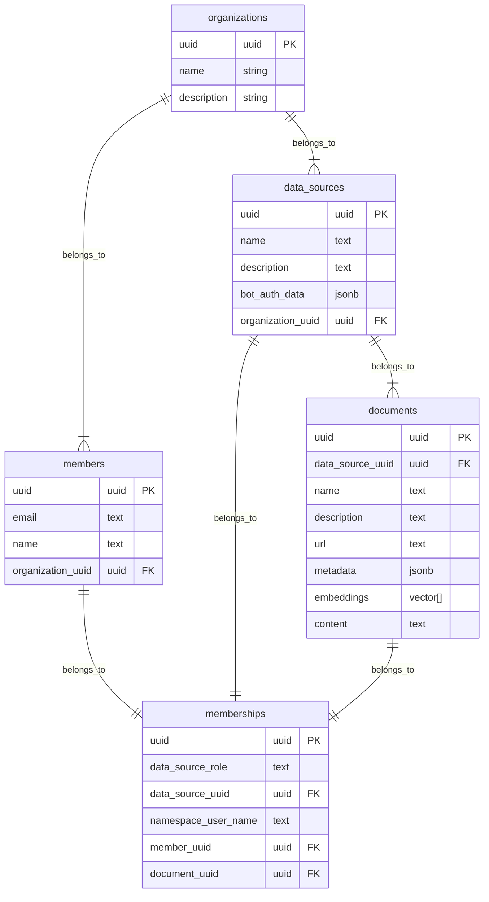
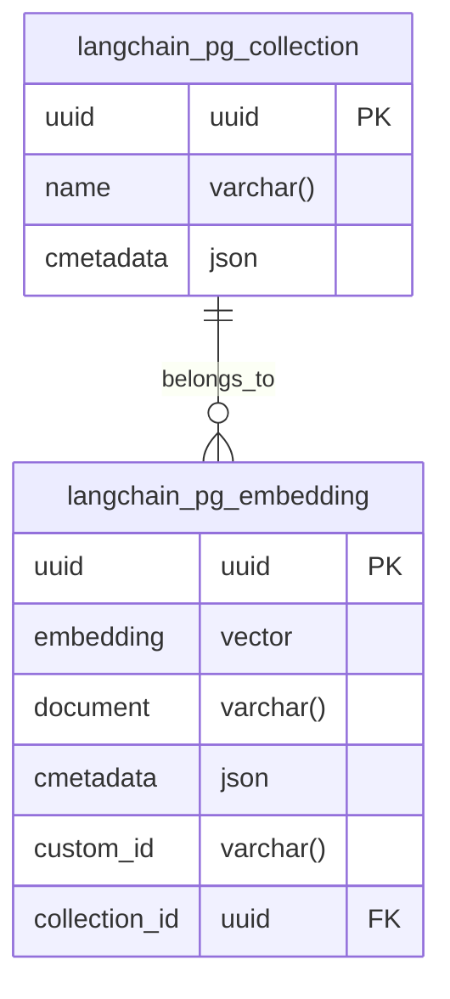

# aishe core

## Setup/Deployment
### Docker Compose
0. Copy .env.example to .env and modify content
4. Create ngrok domain
6. Setup [ngrok agent auth](https://dashboard.ngrok.com/get-started/your-authtoken)
7. [Setup google access](https://python.langchain.com/docs/integrations/tools/google_search) to llm and add keys to .env
8. Setup langsmith in .env
8. Start everything as a docker compose with code hot reload: `docker compose --env-file .env -p aishe_ai up`

### Conventional
0. Copy .env.example to .env and modify content
1. Install `tesseract-ocr` for your system with apt etc
2. Install python deps: `pip3 install -r requirements.txt` or update current `pip install -r requirements.txt --upgrade`
3. Install chromium `pip install -q playwright beautifulsoup4 playwright install`
4. Create ngrok domain
5. Install [ngrok](https://ngrok.com/download)
6. Setup [ngrok agent auth](https://dashboard.ngrok.com/get-started/your-authtoken)
7. [Setup google access](https://python.langchain.com/docs/integrations/tools/google_search) to llm and add keys to .env
8. Setup langsmith in .env
8. Start fastapi: `uvicorn app:app --reload`
9. Start ngrok: `ngrok http --domain=DOMAIN 8000`, domain must be the same as the bot creation

## Issues
- Browser is not starting for webscraping, for example within the webpage_tool:
    - add to the browser launch parameters: `args=["--disable-gpu"]` -> `browser = await p.chromium.launch(headless=True, args=["--disable-gpu"])`
    - only observed with wsl2 systems

## Formatting
- `black FOLDER_NAME`

## Testing
tbd

## Docker
[Public image repo](europe-west10-docker.pkg.dev/aisheai/docker-images/core:latest)
`docker run -d -p 80:80 --env-file .env aishe-ai`

## Data structures
### Planned
For prompts regarding internal company data, which will the regulary be scraped.
When user prompts system, following will happen:
1. get member from given email (search)
2. get memberships from member (join)
3. get documents from memberships (join)
4. iterate over accessable documents and add their embeddings into the vector space for similarity search with given user prompt

### langchain pqvector
