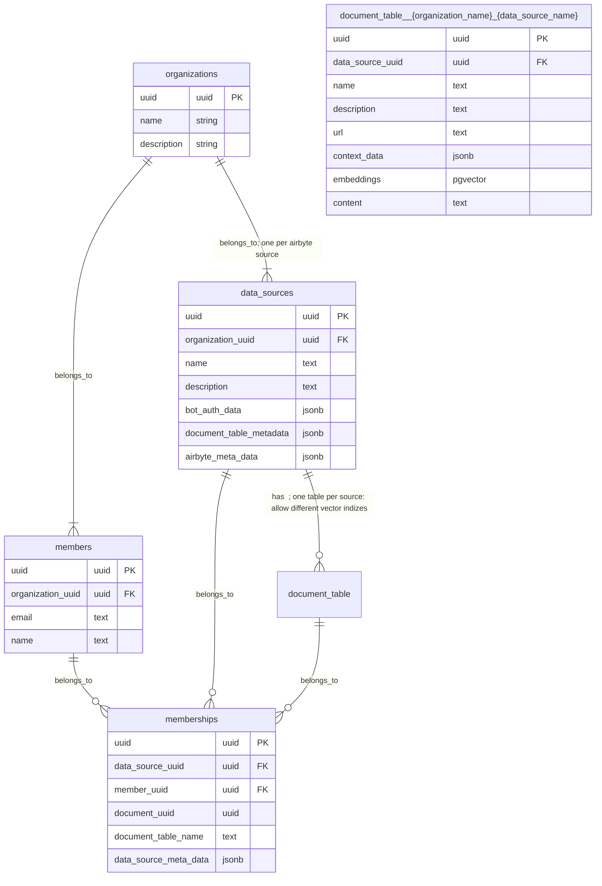
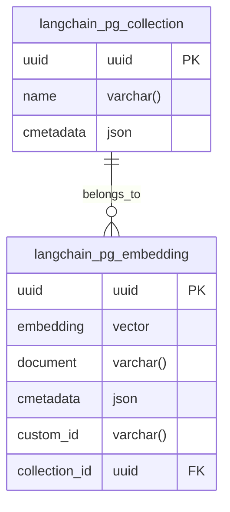

# aishe core

## Setup/Deployment
### Docker Compose
0. Copy .env.example to .env and modify content
4. Create ngrok domain
6. Setup [ngrok agent auth](https://dashboard.ngrok.com/get-started/your-authtoken)
7. [Setup google access](https://python.langchain.com/docs/integrations/tools/google_search) to llm and add keys to .env
8. Setup langsmith in .env
8. Start everything as a docker compose with code hot reload: `docker compose --env-file .env -p aishe_ai up`

### Conventional
0. Copy .env.example to .env and modify content
1. Install `tesseract-ocr` for your system with apt etc
2. Install python deps: `pip3 install -r requirements.txt` or update current `pip install -r requirements.txt --upgrade`
3. Install chromium `pip install -q playwright beautifulsoup4 playwright install`
4. Create ngrok domain
5. Install [ngrok](https://ngrok.com/download)
6. Setup [ngrok agent auth](https://dashboard.ngrok.com/get-started/your-authtoken)
7. [Setup google access](https://python.langchain.com/docs/integrations/tools/google_search) to llm and add keys to .env
8. Setup langsmith in .env
8. Start fastapi: `uvicorn app:app --reload`
9. Start ngrok: `ngrok http --domain=DOMAIN 8000`, domain must be the same as the bot creation
10. Setup [langfuse](https://github.com/langfuse/langfuse?tab=readme-ov-file#get-started) and its needed envs

## Issues
- Browser is not starting for webscraping, for example within the webpage_tool:
    - add to the browser launch parameters: `args=["--disable-gpu"]` -> `browser = await p.chromium.launch(headless=True, args=["--disable-gpu"])`
    - only observed with wsl2 systems

## Formatting
- `black FOLDER_NAME`

## Testing
tbd

## Docker
[Public image repo](europe-west10-docker.pkg.dev/aisheai/docker-images/core:latest)
`docker run -d -p 80:80 --env-file .env aishe-ai`

## Data structures
### Planned Query Flow for Internal Company Data Prompts

The following steps outline the process for handling prompts regarding internal company data, which is regularly scraped and updated in the database. This process is designed to retrieve relevant document vectors based on the user's access rights, determined by their memberships in various data sources.

#### 1. Retrieve Member Information
- **Objective:** Identify the member based on the provided email.
- **Process:** The system searches the `members` table using the given email address. This table contains member details, including their unique identifier (`uuid`), which is crucial for subsequent steps.

#### 2. Acquire Member's Memberships
- **Objective:** Determine the data sources to which the member has access.
- **Process:** With the member's `uuid`, the system retrieves all associated memberships from the `memberships` table. Each membership record links a member to a data source and potentially to specific documents within that source.

#### 3. Perform Similarity Search in Document Vectors
- **Objective:** Find documents relevant to the user's prompt, to which the user has access.
- **Process:** 
  - The system uses the memberships obtained in the previous step to identify accessible documents. This involves a join operation between the `memberships` table and the dynamically named `document_table__{organization_name}_{data_source_name}`, using the `document_uuid`.
  - A similarity search is conducted on the `embeddings` field within the `document_table`. This search finds documents whose vector representations are similar to the vector representation of the user's prompt.
  - This step is crucial for ensuring that the user only accesses documents they are permitted to view, based on their memberships.

#### 4. Integrate Found Vectors into Langchain Context
- **Objective:** Enhance the language model's context with the found document vectors.
- **Process:** 
  - The vectors retrieved from the similarity search are added to the prompt's vector space. This integration is part of the language chain processing, which occurs outside the database.
  - This step is essential for tailoring the language model's responses to be more relevant and informed by the specific content the user has access to.

### Note:
- The efficiency of this process is heavily reliant on the proper indexing of tables, especially for large datasets. Indexes on fields like `email` in the `members` table and `uuid` fields in all tables are crucial.
- The similarity search's performance in the `document_table` depends on the implementation of vector operations in PostgreSQL, particularly the use of `pgvector`.
- This flow assumes a robust system for managing and querying dynamically named `document_table`s, which is vital for the scalability and maintainability of the system.

### Indexing Recommendations:

#### Organizations Table:
- Primary Key Index on `uuid`.
- Optional Index on `name` if frequently queried.

#### Data Sources Table:
- Primary Key Index on `uuid`.
- Foreign Key Index on `organization_uuid`.
- Optional Index on `name` if frequently queried.

#### Members Table:
- Primary Key Index on `uuid`.
- Foreign Key Index on `organization_uuid`.
- Index on `email` for search operations.

#### Document Table:
- Primary Key Index on `uuid`.
- Foreign Key Index on `data_source_uuid`.
- Optional Indexes on `name`, `url`, `metadata`.
- Appropriate indexing for `embeddings` (pgvector).

#### Memberships Table:
- Primary Key Index on `uuid`.
- Foreign Key Indexes on `data_source_uuid`, `member_uuid`, `document_uuid`.

### langchain pgvector
